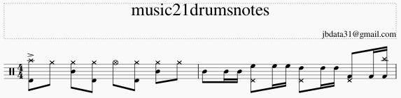

# music21drums

TODO

`aPart0 = drumsPart()`
`# add a dummy Instrument to avoid musecore warn`
`aInstrument = instrument.Instrument()`
`aPart0.insert(aInstrument)`
`aMeasure0 = stream.Measure()`
`aMeasure0.append(Chord([Crash(), Kick()]))`
`aMeasure0.append(HiHat())`
`aMeasure0.append(Chord([HiHat(), Snare()]))`
`aMeasure0.append(Chord([HiHat(), Kick()]))`
`aMeasure0.append(OpenHiHat())`
`aMeasure0.append(Chord([HiHat(), Kick()]))`
`aMeasure0.append(Chord([HiHat(), Snare()]))`
`aMeasure0.append(HiHat())`
`aPart0.append(aMeasure0)`

